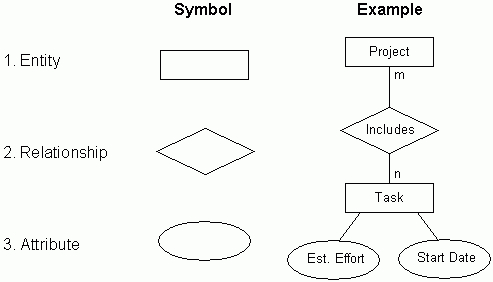
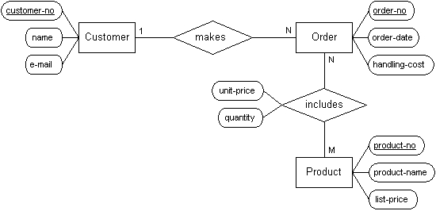
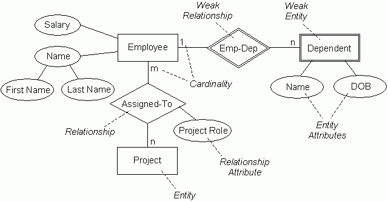

# Bootcamp - Data Science - Noviembre 2022 - The Bridge


----------

### **Foldername**: 2211_sql_thebridge

***Repository link:*** https://github.com/MNievas12/2211_sql_thebridge

*To git clone by https:*

"git clone https://github.com/MNievas12/2211_sql_thebridge"


---------

*Remember, you have many cheatsheets. Learn to use it.*

*PythonTutor is your friend... take care of it.*

*Use Google everytime you need. Google must be your shadow.*

---------

**Teacher Assistant**: *Javier Tenorio Ruiz*

- javier.tenorio@thebridgeschool.es

**Teacher Assistant**: *Mario Sabrás Ramírez*

- mario.sabras@thebridgeschool.es

**Lead Instructor**: *Miguel Ángel Nievas Fuertes*

- miguel.nievas@thebridgeschool.es
---------

# SQL
What is SQL?
* SQL stands for Structured Query Language
* SQL lets you access and manipulate databases
* SQL is an ANSI (American National Standards Institute) standard


## Learn to design ER-Diagrams
Basic Concepts
* Understand the requirements
* Don't think physical; think conceptual
* Don't think process; think structure 
* Don't think navigation; think relationship


## Entity - Attributes
### Entity
* Something that exists and is capable of being described
* Entities are comprised of attributes

### Relationships 
* Define how the different entities are associated with each other
* A relationship is defined by the keys of the participating entities 
    * Primary - foreign key
    * Parent - child relationship

### Attributes
An attribute is a characteristic of an entity. 
Every attribute does one of three things:
* Describe 
* Identify 
* Relate 


## ER-Diagram basic symbols



## ER-Diagram examples (1/2)



## ER-Diagram examples (2/2)



## The logical-to-physical mapping

* Entities into tables
* Attributes into columns
* Domains into data types & constraints
    * Domain - an area of interest or an area over which a person has control

	From <http://dictionary.cambridge.org/dictionary/english/domain> 


## Key Concepts
* Data Types
* Constraints
* Primary Key
* Nullability
* Fixed- Variable length
* Identity Columns
* Indexes (Clustered - Non Clustered)


## Primary and foreign keys
### SQL PRIMARY KEY Constraint
The PRIMARY KEY constraint uniquely identifies each record in a database table.
Primary keys must contain UNIQUE values.
A primary key column cannot contain NULL values.
Most tables should have a primary key, and each table can have only ONE primary key.

### SQL FOREIGN KEY Constraint
A FOREIGN KEY in one table points to a PRIMARY KEY in another table.


## SQL Constraints
SQL constraints are used to specify rules for the data in a table.
If there is any violation between the constraint and the data action, 
the action is aborted by the constraint.

Constraints can be specified when the table is created 
or after the table is created. 


### SQL CREATE TABLE + CONSTRAINT Syntax
```sql
CREATE TABLE table_name
(
column_name1 data_type(size) constraint_name,
column_name2 data_type(size) constraint_name,
column_name3 data_type(size) constraint_name,
....
);
```


In SQL, we have the following constraints:
* NOT NULL - Indicates that a column cannot store NULL value
* UNIQUE - Ensures that each row for a column must have a unique value
* PRIMARY KEY - A combination of a NOT NULL and UNIQUE. Ensures that a column (or combination of two or more columns) have a unique identity which helps to find a particular record in a table more easily and quickly
* FOREIGN KEY - Ensure the referential integrity of the data in one table to match values in another table
* CHECK - Ensures that the value in a column meets a specific condition
* DEFAULT - Specifies a default value for a column


## SQL Select Queries
Always remeber that sql queries resemble spoken language!

```sql
SELECT column_name1, column_name2, ...
FROM table_name
WHERE condition
GROUP BY column_name1, column_name2, ...
ORDER BY column_name1, ...;
```


### Example
```sql
--Display last and first name and the title of the employees that are situated in USA and are born before 1960, alphabetically by their names.
SELECT EmployeeID, LastName, FirstName, Title 
FROM Employees
WHERE Country = 'USA'
	AND BirthDate < '1960-01-01'
ORDER BY LastName, FirstName;
```


## SQL LIKE Operator & Wildcards
The LIKE operator is used to search for a specified pattern in a column.
Wildcard characters are used with the SQL LIKE operator. 
We will need the following:
1. `%  A substitute for zero or more characters
2. `_  A substitute for a single character


## Examples
```sql
-- Returns Customers from Bern, Berlin and Bergamo
SELECT * FROM Customers
WHERE City LIKE 'ber%';
-- Returns Customers from Bruxelles, Resende, Buenos Aires etc.
SELECT * FROM Customers
WHERE City LIKE '%es%';  
-- Returns Customers with regions CA and WA
select *
from Customers
where Region like '_A'

```


## NULL values
* NULL values represent missing unknown data
* By default a column can hold NULL values
* NULL is different from zero
* To check for NULL we use IS or IS NOT NULL instead of = or <>.
Syntax example:

```sql
-- Get all customers for whom we have fax numbers.
SELECT * 
FROM Customers 
WHERE Fax IS NOT NULL;

-- Get all customers for whom we do not have fax numbers.
SELECT * 
FROM Customers 
WHERE Fax IS NULL;
```
