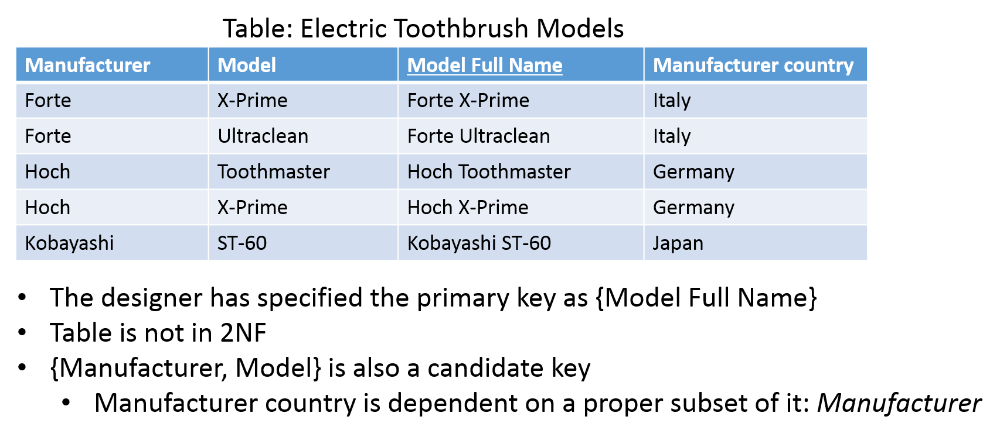
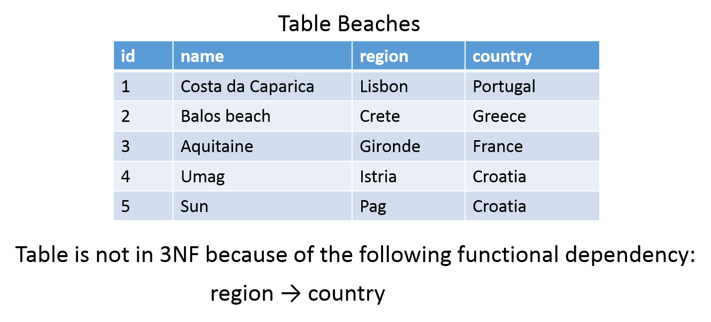

## Database Normalization

## Background and terminology
* What is a relational database
* What is a primary key
* What is a foreign key

## Relational Database Management System (RDBMS)
* Collection of information organized in tables
  * Tables are also relations
* Tables are constructed and associated to each other through shared fields – “common” fields
  * Fields are also “columns” or “attributes”
* A set of attributes comprises a record
  * Records are also “rows” or “tuples”
* Tables are related through common fields designated as primary and foreign keys
* Allows to update and delete data while ensuring accuracy

## Primary and Foreign Key Fields
* Primary Key
  * Primary key fields must be unique and cannot contain a null value
  * Each table should have a primary key field
  * Concatenated keys: using more than one field as a primary key field

* Foreign key
  * Fields in a table that refer to the primary key in another table
  * The data in this field must exactly match data contained in the primary key field

## Relational database model
* Basic design principle of relational database model
  * Group attribute types of an entity
  * Create tables for the entity types
  * Correlate tables as they have been defined in E-R diagram
* Questions that occur during the aforementioned process have to do with the selection of the attributes that will be grouped and form a table
  * Based on which criterion we perform the selection?
  * Is there any better combination of the attributes that could lead to a more flexible and reliable database?
* Presentation of the basic rules followed during designing a database

## Database anomalies
* Update anomalies
  * If data items are scattered and are not linked to each other properly, then it could lead to strange situations. For example, when we try to update one data item having its copies scattered over several places, a few instances get updated properly while a few others are left with old values. Such instances leave the database in an inconsistent state.

* Deletion anomalies 
  * We tried to delete a record, but parts of it was left undeleted because of unawareness, the data is also saved somewhere else

* Insert anomalies  
  * We tried to insert data in a record that does not exist at all

* Normalization is a method to remove all these anomalies and bring the database to a consistent state

## What is Normalization
* The process by which we efficiently organize data to achieve these goals:
  * Eliminating redundancy
  * Ensuring data is stored in the correct table
  * Eliminating need for restructuring database when data is added

* Five levels of normal form
  * In order to achieve one level of normal form, each previous level must be met

* Third normal form is sufficient for most typical database applications

## Problem without normalization
* Without Normalization, it becomes difficult to handle and update the database, without facing data loss 
* Insertion, Update and Deletion anomalies are very frequent if the database is not normalized

## Insertion anomaly
* Suppose for a new admission, we have a Student id (S_id), name and address of a student but if student has not opted for any subjects yet then we have to insert NULL there, leading to insertion anomaly

## Update anomaly
* To update address of a student who occurs twice or more than twice in a table, we will have to update S_Address column in all the rows, else data will become inconsistent

## Deletion anomaly
* If (S_id) 401 has only one subject and temporarily he drops it, when we delete that row, entire student record will be deleted along with it

## Normalization overview
* Normalization is a process of organizing the data in database to avoid data redundancy, insertion anomaly, update anomaly and deletion anomaly.

* The most commonly used normal forms:
  * First normal form (1NF)
  * Second normal form (2NF)
  * Third normal form (3NF)

## 1st Normal Form
First normal form: An attribute (column) of a table cannot hold multiple values. It should hold only atomic values

## 1st normal form

## 1st normal form

* SELECT: Are all possible queries feasible to be expressed? 
* INSERT: Can new data be inserted without requiring complicated queries?
* DELETE: Can data be deleted without losing valuable information? 
* UPDATE: Can data modification be performed in an easy way and without modifying data that should not be affected?

## 1st normal form – select failure

SELECT *
FROM employee
WHERE language = ‘English’

Potential solution:
SELECT *
FROM employee
WHERE language LIKE ‘%English%’

## 1st normal form – update failure

What happens if we want to add ‘English’ language to George?

We need to know that he already speaks French:
UPDATE employee
SET language = ‘French, English’
WHERE name = ‘George’

## 1st normal form – An alternative approach

## 1st normal form – New problems
* Storage: More storage is required for data that are not needed
* SELECT: It is easier to perform. Employees that speak a specific language are easier to be found.
* INSERT: Data insertion is problematic. 
* UPDATE: Data update is easy to perform.
* DELETE: Data deletion is easy to perform

## 1st normal form

* First normal form: An attribute (column) of a table cannot hold multiple values. It should hold only atomic values

## 1st normal form

## 1st normal form
* The multivalued attribute is turned into a “Many-to-Many” relationship

## 1st normal form – In a nutshell
* First normal form (1NF) sets the very basic rules for an organized database
  * There are no repeating or duplicate fields
  * Each cell contains only a single value
  * Each record is unique (identified by a primary key)

## 1st normal form – In a nutshell

## Functional Dependencies
* A functional dependency is defined as an association among a table’s attributes
  * Suppose that given the value of one attribute, we can obtain the value of another attribute
* An attribute B is considered as functional dependent to an attribute A if the value of A sets uniquely the value of B
* The aforementioned association is depicted as Α → Β
  * Read as: A determines B or B depends on A

## Functional dependencies – example 1
Examples of functional dependencies:
* ZipCode → AddressCity
  * 16652 is Huntingdon’s ZIP
* ArtistName → BirthYear
  * Picasso was born in 1881
* Autobrand → Manufacturer, Engine type
  * Pontiac is built by General Motors with gasoline engine
* Author, Title → PublDate
  * Shakespeare’s Hamlet was published in 1600

## Functional dependencies – example 2

We say an attribute B has a functional dependency on another attribute A, if for any two records, which have the same value for A, then the values for B in these two records must be the same

## Functional dependencies – example 3

Knowing the Team name we can identify uniquely the League it participates

## Functional dependencies – example 4

## Functional dependencies
* A functional dependency can be full or partial
  * Full dependency
  * Partial dependency
* A partial dependency is a situation where a non-prime attribute is functionally dependent to a portion/part of a primary key/Candidate key
* A functional dependency is a full functional dependency when the removal of any attribute means that the dependency does not hold any more

## 2nd Normal Form
Second normal form: an entity type is in second normal form (2NF) when it is in 1NF and when every non-key attribute, any attribute that is not part of the primary key, is fully dependent on the primary key

## 2nd Normal Form – example 1

2NF: No non-prime attribute is dependent on the proper subset of any candidate key of the table

## 2nd Normal Form – example 1
* Primary key is composite
  * Comprises of ‘Title’ and ‘Actor’ attributes
* The following functional dependencies occur:
  * {title, actor} → director
  * title → director

## 2nd normal form – Approach

## 2nd normal form – Example 1
* We split the initial table to the following two:

## 2nd normal form – Example 2

{Manufacturer, Model} → Manufacturer Country

## 2nd normal form – Example 2
* We split the initial table to the following two:

## 2nd normal form – In a nutshell
* A table is said to in second normal form (2NF) if both the following conditions hold:
  * Table is in first normal form (1NF)
  * No non-prime attribute is dependent on the proper subset of any candidate key of the table

## 3rd Normal Form
Third normal form: an entity type is in third normal form (3NF) when it is in 2NF and all non-primary fields are dependent on the primary key

## 3rd Normal Form
* Refers to the functional dependencies of attributes that do not belong to the primary key. 
* Normalization with decomposition
  * Decomposition is the process of breaking a relation into two or more relations to eliminate the redundancies and corresponding anomalies
  * The dependent part of the functional dependency Y → Z, (i.e. Z) is removed from the initial table
  * The parts of the functional dependency Y → Z, (i.e. Y and Z) form a new table with Y being the primary key.
  * The initial table can be produced by joining the new tables

## 3rd Normal Form

## 3rd Normal Form
* 3NF requires that the initial table is broken down to two tables
* The dependent part ‘region’ of the functional dependency region → country is removed from the table
* The parts of the functional dependency form a new table with primary key the attribute ‘region’

## 3rd Normal Form

## 3rd normal form – In a nutshell
* A table is said to in third normal form (3NF) if both the following conditions hold:
  * Table is in second normal form (2NF)
  * All non-primary fields are dependent on the primary key

## Some good reasons not to normalize
* Joins are expensive
  * Normalizing your database often involves creating lots of tables. 
  * In fact, you can easily wind up with what might seem like a simple query spanning five or ten tables.

* Normalized design is difficult

* Quick and dirty should be quick and dirty
  * If you’re just developing a prototype, just do whatever works quickly
  * Rapid application development is sometimes more important than elegant design.